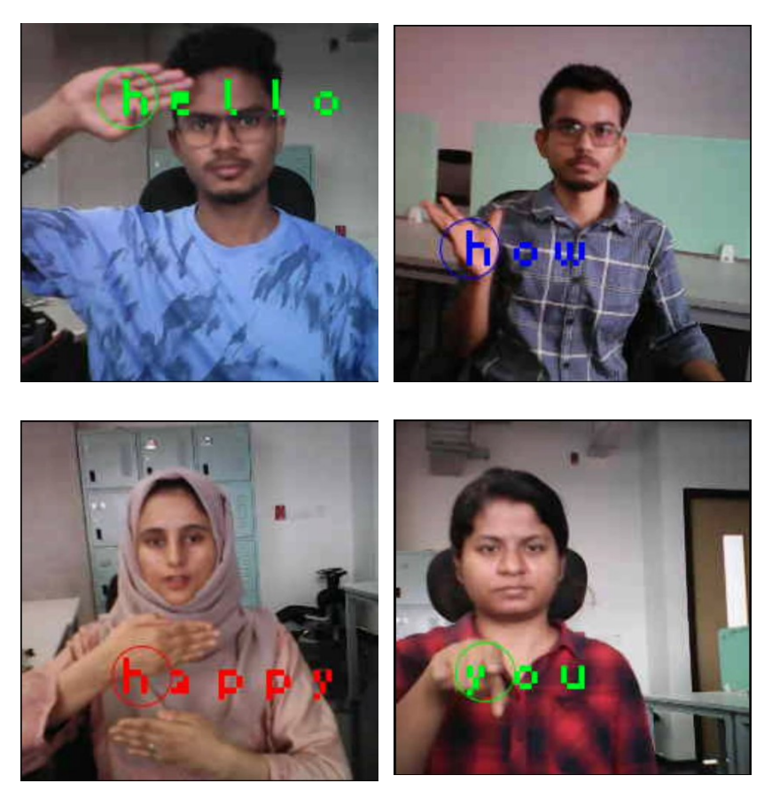
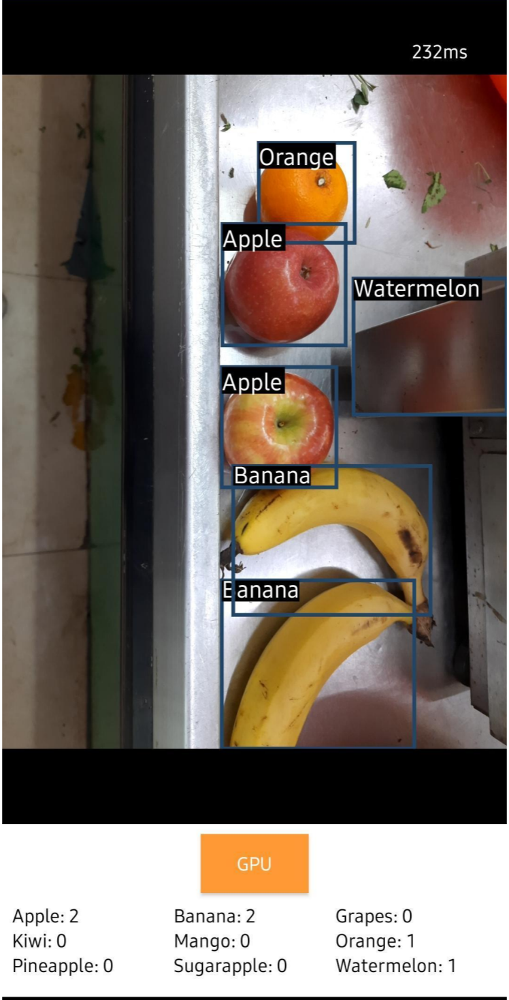

### Course project
---  

### List of Projects
1. [Portable Sign-language Translater](projects/sign_lang.md)
2. {width = 200px}
3. 
4. [Fruit Detection](projects/fruit_detection.md)
5. ){ width = 200px }
6. 
7. [Vehicle Monitoring](projects/vehicle_monitoring.md)
8. [Anomly Detection in PV Panel](projects/04-anomly-pv-panels.md)
9. [AI-Powered Posture Correction System on Edge Devices](projects/05-posture-correction.md)
10. [Real-Time PPE Violation Detection and Servo-Actuated MCB Shutdown](projects/06-ppe-violation.md)
11. [Acoustic Based Predictive Maintenance](projects/07-predicitive-maintenance.md)
12. [Real Time Analog Meter Reader Using Edge Computing](projects/08-analog-meter-reader.md)
13. [AI–Based Intrusion Detection System for CAN Bus Security](projects/09-intrusion-detection.md)
14. [IntelliPark: Smart Parking Detection System using Nicla Vision](projects/10-smart-parking.md)
15. [Smart Waste Segregation using Arduino BLE and Edge AI](projects/11-waste-segregation.md)
16. [Enhancing Plan-Seq-Learn with Activation-aware Weight Quantization for Efficient Robotic Manipulation](projects/12-activation-aware-quantization.md)
17. [Smart Irrigation System for Precision Agriculture](projects/13-smart-irrigation.md)
18. [Intelligent State of Charge (SoC) Estimation Using LSTM on Edge Devices](projects/14-charge-degrad-esti-battery.md)
19. [Compressing LLMs for Edge Devices: Using Game Theory for Pruning](projects/15-compres-llms-prune.md)
20. [AI-Powered Machine Learning Pipeline for Smart Manufacturing](projects/16-ml-smart-manufacturing.md)
21. [A Magnetometer-Driven Alert System for Asset Protection & Anti-Theft Systems](projects/17-anti-theft-alert.md)
22. [AI Powered Blind Assistance device](projects/18-blind-assistance.md)
23. [On-Device Object Recognition and Proximity Feedback for Blind Navigation Aids](projects/19-blind-navigation-aid.md)
24. [Feature Estimation and Object Identification](projects/20-object-identification.md)
25. [Driver Drowsiness and Distraction Detection System](projects/21-driver-behaviour.md)
26. [UrgentCare-AI: Patient Monitoring System](projects/22-urgent-care.md)
27. [Voice Authentication and Command Classification for Two-Wheelers](projects/23-voice-authentication.md)
28. [ECG Signal Acquisition and Arrhythmia Detection using Arduino](projects/24-arrhythmia-detection.md)
29. [Bird Voice Recognition using Deep Learning](projects/25-bird-voice-classifier.md)
30. [Smart Retail Verification using FOMO model on Nicla Vision](projects/26-retail-verification.md)
31. [Air Piano: Real-Time Finger Detection for Virtual Piano Playing](projects/27-air-piano.md)
