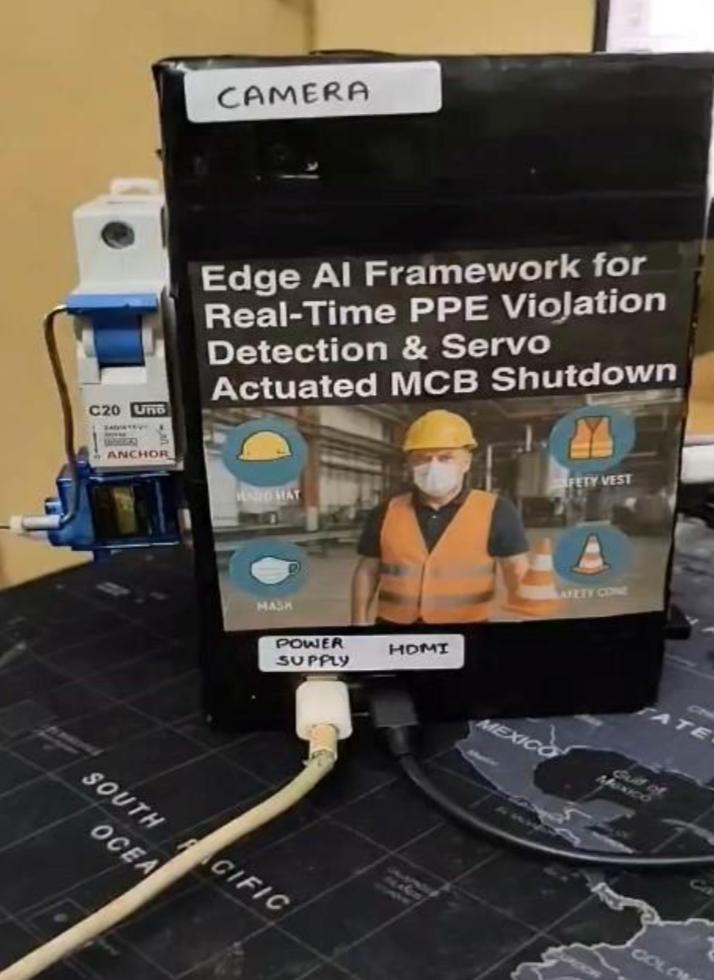

## Real-Time PPE Violation Detection and Servo-Actuated MCB Shutdown 

### Objective

This project develops a real-time Personal Protective Equipment (PPE) violation detection system for industrial environments, utilizing a Raspberry Pi 4 and an ESP32 microcontroller, integrated with a servo-actuated Miniature Circuit Breaker (MCB) shutdown mechanism. The system processes live video feed from a 5MP Pi Camera to detect PPE non-compliance (e.g., missing hardhats, masks, or safety vests), sends alerts via serial communication to the ESP32, and triggers a servo motor to shut off power via an MCB, ensuring immediate safety enforcement. The prototype uses a YOLOv8 model, demonstrating edge AI, computer vision, and physical actuation for enhanced factory safety. 

  

### Methodology

#### 1. Hardware Required and Specifications

| Component          | Specifications                                              |
|--------------------|-------------------------------------------------------------|
| **Raspberry Pi 4 Model B** | Quad-core Cortex-A72 (1.5 GHz), 4GB RAM, 32GB microSD, Wi-Fi, USB 3.0 |
| **ESP32-WROOM-32**          | Dual-core Tensilica LX6 (240 MHz), 520KB SRAM, Wi-Fi, Bluetooth          |
| **Pi Camera 5MP**           | 5MP, 1080p video, fixed focus, compatible with Raspberry Pi              |
| **SG90 Servo Motor**        | 1.8 kg-cm torque, 0.1 sec/60° speed, 4.8-6V                             |
| **MCB (Miniature Circuit Breaker)** | Single-pole, 16A, 230V AC                                   |
| **USB Power Supply**        | 5V, 3A for Raspberry Pi; 5V, 2A for ESP32                                |

---

#### 2. Software Used

- **Raspberry Pi OS:** Debian-based OS for Raspberry Pi.  
- **Arduino IDE:** For programming the ESP32 and servo control.  
- **Python 3.10:** For model inference, OpenCV integration, and serial communication.

---

### Data Collection

Data was sourced from the **Construction Site Safety (CSS)** dataset on Kaggle, provided via Roboflow:

- **Size:** 2,801 images in YOLO format.  
- **Split:** 2,605 training, 114 validation, 82 testing images.  
- **Classes (10):** Hardhat, Mask, NO-Hardhat, NO-Mask, NO-Safety Vest, Person, Safety Cone, Safety Vest, Machinery, Vehicle.  
- **Annotations:** Bounding boxes in YOLO format (`<class_id> <center_x> <center_y> <width> <height>`, normalized [0,1]).  
- **Preprocessing:** Images resized to 640x640 pixels.  
- **Augmentation:** Horizontal flip, mosaic, grayscale, rotation, brightness adjustment, cutouts.

The 5MP Pi Camera captured live footage at 320x240 resolution in YUV420 format, processed at 10 FPS to optimize performance on the Raspberry Pi.

---

### Model Development and Compression

- **Model:** YOLOv8n (nano) trained using Ultralytics framework on NVIDIA Tesla T4 GPU  
- **Input:** 640x640 RGB images  
- **Architecture:** YOLOv8n, lightweight CNN with CSPDarknet53 backbone, PAN-FPN neck, and detection head (~3.2M parameters)  
- **Training Parameters:**  
  - Epochs: 100  
  - Batch size: 16  
  - Optimizer: Auto (Adam or SGD likely)  
  - Learning rate: 1e-3, decay factor 0.01  
  - Weight decay: 5e-4  
  - Patience: 20 epochs  
  - Dropout: 0.0  
  - Label smoothing: 0.0  
- **Performance:**  
  - mAP@0.5: 0.90  
  - F1 score: 0.87 on validation set  

The model was exported from PyTorch (`best.pt`) to ONNX format and quantized to int8, reducing its size to ~2 MB for efficient deployment on the Raspberry Pi. Inference time was approximately 25 ms per frame using ONNX Runtime.

| Metric          | Training | Validation | Test  |
|-----------------|----------|------------|-------|
| Precision       | 0.89     | 0.88       | 0.87  |
| Recall          | 0.91     | 0.90       | 0.89  |
| mAP@0.5         | 0.92     | 0.90       | 0.89  |
| Inference Time (ms) | -      | -          | 25    |

---

### Model Deployment

The system, implemented in `Fullcode 2.txt`, runs on the Raspberry Pi using the ONNX model (`best.onnx`):

- **Video Capture:**  
  - 5MP Pi Camera captures 320x240 YUV420 video via `libcamera-vid`  
  - Converted to BGR using OpenCV  

- **Inference:**  
  - YOLOv8 class preprocesses frames (resize to 640x640, normalize, pad)  
  - Runs inference with ONNX Runtime  
  - Post-processes outputs using NMS (confidence threshold 0.5, IoU threshold 0.5)  

- **Violation Logic:**  
  - Detects NO-Hardhat, NO-Mask, or NO-Safety Vest classes  
  - Increments `violation_count`  
  - When count reaches 10, triggers a "CODE RED" event  

- **Serial Communication:**  
  - Raspberry Pi sends `"MCB_OFF\n"` command to ESP32 via UART (`/dev/serial0`, 115200 baud)  

- **Servo Actuation:**  
  - ESP32 listens on UART2 (RXD2=16, TXD2=17)  
  - Upon receiving `"MCB_OFF"`, moves SG90 servo (GPIO 18) from 90° (closed) to 0° (open) to trip MCB  
  - Waits 3 seconds, then returns to 90° to reset  

---

### Prototype and Demo

- Tested in a simulated factory environment  
- Raspberry Pi processed live footage, displayed bounding boxes and labels via OpenCV  
- Detected violations (e.g., missing hardhat)  
- On reaching 10 violations, signaled ESP32 to trigger MCB shutdown within 2 seconds  
- A demo video showcases the system: **Demo Video**

> **Caption:** Screenshot from Demo Showing Violation Detection

<!-- ---

## Project Resources

- **Code Repository:** [GitHub](https://github.com/BalajiB-13/Edge-AI-Real-Time-PPE-Violation-Detection-and-MCB-Shutdown)  
- `YOLOv8_PPE2Final (1).ipynb`: Model training and export script  
- `Fullcode 2.txt`: Raspberry Pi inference and communication script  
- `sketch_apr27a.ino`: ESP32 servo control firmware  
- **Dataset:** [Kaggle Construction Site Safety](https://www.kaggle.com/datasets/snehilsanyal/construction-site-safety-image-dataset-roboflow)  
- **Research Paper:** `EdgeAI_research_paper.pdf`

--- -->

### Challenges and Workarounds

| Challenge                                  | Workaround                                                                                         |
|--------------------------------------------|--------------------------------------------------------------------------------------------------|
| Limited Raspberry Pi 4 processing power    | Used YOLOv8n and int8 quantization, reducing inference time from ~100 ms to 25 ms                 |
| Unstable serial communication              | Used newline-terminated UART messages with error checking for robust communication               |
| Low-light conditions reduced accuracy      | Applied OpenCV contrast enhancement and included low-light images in training dataset augmentation |
| Balancing sensitivity and false positives  | Tuned violation threshold to 10 frames for timely MCB tripping without premature shutdown        |
| Servo actuation reliability                 | Adjusted servo angle from 45° to 0°, added 3D-printed mounts for mechanical stability             |

---

### References

- Construction Site Safety Image Dataset, Kaggle, 2023.  
- YOLOv8 Documentation, Ultralytics, 2025.  
- Raspberry Pi 4 Documentation, 2025.  

