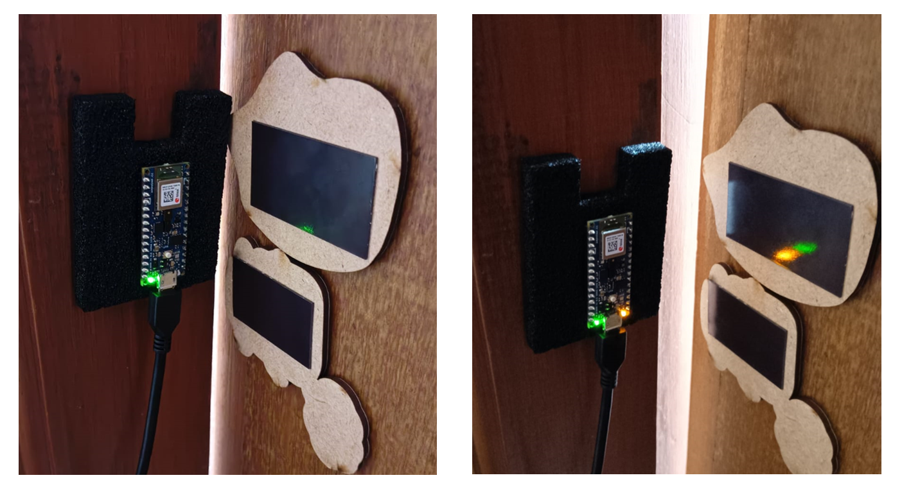

## A Magnetometer-Driven Alert System for Asset Protection & Anti-Theft Systems

### Introduction

This project presents a compact AI-powered alert system that leverages magnetometer data to detect movement or unauthorized access to valuable assets. It is implemented with an on-device deep learning model and deployed onto a microcontroller to trigger real-time alerts (e.g., LED blinking and Bluetooth messaging).

The need for robust and cost-efficient anti-theft mechanisms in remote or indoor asset monitoring has driven the development of this system. Magnetic field variations serve as a reliable source to detect proximity changes or unauthorized movements in metallic objects like lockers, drawers, and safes.

  

### Hardware and Software Required

**Hardware**
- Arduino Nano BLE Sense
- Magnetometer Sensor (LIS3MDL)
- LED Indicator
- Bluetooth module (on-board BLE)
**Software**
- Python (TensorFlow, scikit-learn, pandas)
- Edge Impulse Studio (for embedded model deployment)
- Arduino IDE (model integration and LED logic)

### Data Collection

Data was collected from a magnetometer by fixing the Nano BLE Sense to the door frame and attaching the magnets to the door itself and swung the door. We captured readings from axes Mx, My, Mz and computed the magnitude. And then we used K-means clustering to generate the labels for the collected data.

### Model Development and Compression

We evaluated multiple models: Decision Tree, Random Forest, SVM, Logistic Regression, LSTM, GRU. However, 1D CNN delivered the best trade-off between performance and efficiency.  The trained model was quantized to INT8 using TensorFlow Lite and reduced to under 20KB.

### Model Deployment

The decision tree model is deployed on Arduino Nano BLE for inference. The device detects magnetic state changes and blinks an LED and communicates via Bluetooth accordingly.

### Prototype and Demo

When the state changes from "Closed" to "Open," the LED starts blinking, and the system logs an alert count. Reverse transitions stop the blinking. This simple mechanism proves effective in real-world testbeds like file cabinets and lockers.

### Refrences

- [TensorFlow Lite - Post-training Integer Quantization](https://www.tensorflow.org/lite/performance/post_training_integer_quant)  

- [Hackster.io - TinyML Projects](https://www.hackster.io/projects/tinyml)
